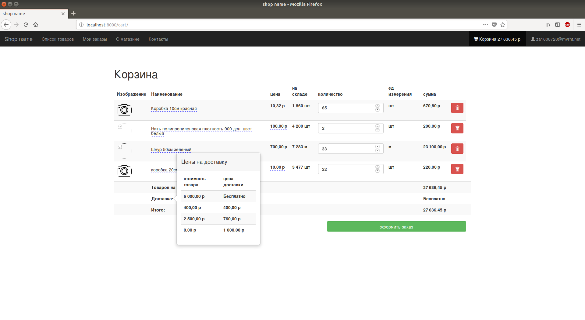
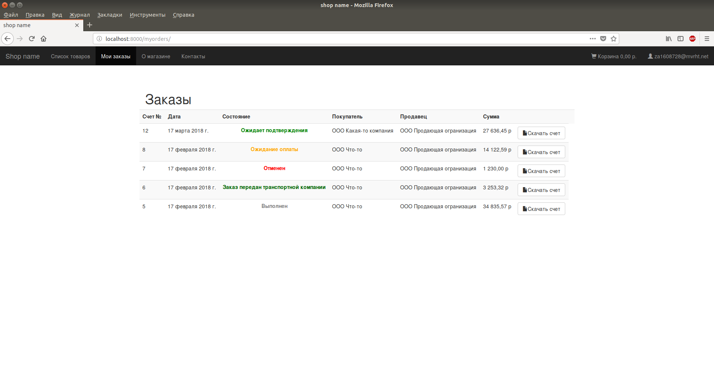

# b2b_shop
Internet shop for b2b wholesale trades. Written in Python3 using Django framework and many other libraries.

##
This shop was built for wholesale trades with a not big amount of types of products.
After making an order you will immediately get an invoice in pdf format.

##
Built With
* [Python3](https://www.python.org/)
* [Django](https://www.djangoproject.com/)
* [django-user-accounts](https://github.com/pinax/django-user-accounts)
* [Pinax Bootstrap Theme](https://github.com/pinax/pinax-theme-bootstrap)
* [wkhtmltopdf](https://wkhtmltopdf.org)
* [pdfkit](https://pypi.python.org/pypi/pdfkit)
* [num2words](https://pypi.python.org/pypi/num2words/)
* [Suggestions by DaData.ru](https://dadata.ru/suggestions/)

##
Screenshots

